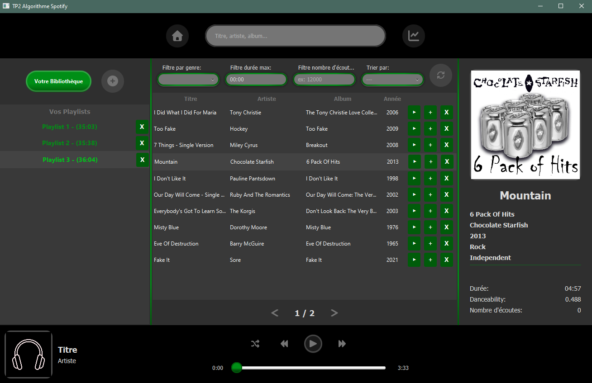
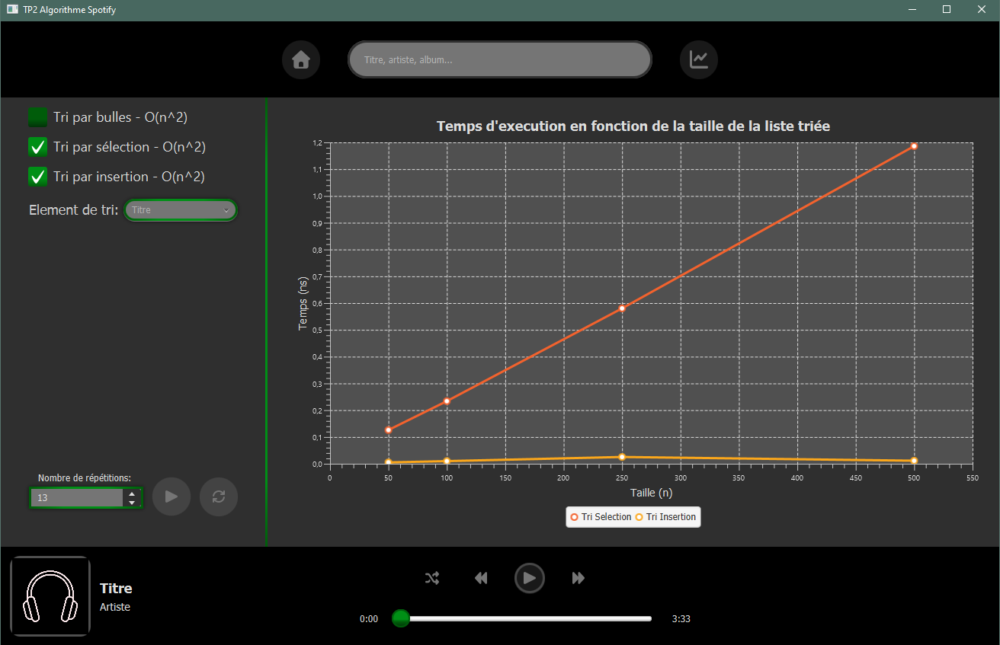

====================================================================

  LABORATOIRE 2 - 420-930-MA - Ete 2026 - gr. 25604

====================================================================


# TP2 Algorithme Spotify

**Cours** : 420-930-MA — Algorithmes et modèles de programmation
**Session** : Été 2026, groupe 25604
**Laboratoire** : 2 (Application JavaFX v1)
**Date de remise** : 13 septembre 2026, 23h59

---

## Équipe

| Nom complet      | Adresse courriel            | Contribution principale                             |
|------------------|-----------------------------|-----------------------------------------------------|
| Francis Boisvert | e2595782@cmaisonneuve.qc.ca | [ex : Modèle, Service, Tris]                        |
| Clément Laflamme | e2595952@cmaisonneuve.qc.ca | [ex : UI FXML, Controller, CSS]                     |
| Mathieu Gosselin | e2596321@cmaisonneuve.qc.ca | Design, UI FXML, CSS, Lecteur, un peu de Controller |

---

## Sujet choisi

**Numéro du sujet** : 3
**Nom du sujet** : Spotify

---

## 🔗 Lien du dépôt GitHub PUBLIC

**URL**: https://github.com/Grindy/tp2_algorithme_spotify

---

## Fonctionnalités implémentées

### ✅ Obligatoires

- ✅ Architecture MVC avec packages séparés (model / service / algorithmes / controller / util)
- ✅ Chargement des données depuis fichier CSV (nombre de lignes : 500
- ✅ Interface JavaFX principale avec liste/tableau
- ✅ Panneau détail affichant l'élément sélectionné
- ✅ Pagination fonctionnelle (taille de page : 25)
- ✅ Filtres multi-critères combinables (nombre implémentés : 4 / 4)
- ✅ Recherche par texte en temps réel
- ✅ Interface Algorithme définie
- ✅ Tri #1 implémenté : Tri par bulles
- ✅ Tri #2 implémenté : Tri par sélection
- ✅ Tri #3 implémenté : Tri par insertion
- ✅ Comparateur/benchmark des tris avec mesure du temps
- ✅ Wishlist / Favoris (ajout, retrait, pas de doublons)
- ✅ CSS appliqué (thème visuel du projet)

### 🎁 Bonus

- ✅ Recherche par texte avec l'album
- ✅ Mode shuffle
- ✅ Formattage des durées au format 0:00

### ❌ Non implémenté

Par manque de temps nous n'avons pas réalisé les bonus suivants:
- ❌ Statistiques d'écoute
- ❌ Import / Export de playlist
- ❌ Playlist "Mix quotidien" auto-créée
- ❌ Thèmes visuels supplémentaires
- ❌ Recherche insensible aux accents

---

## Structure du projet

```
tp2_algorithme_spotify/
├── pom.xml
├── README.md
└── src/
    └── main/
        ├── java/
        │   └── com/maisonneuve/tp2_algorithme_spotify/
        │       ├── algorithme/
        │       │   └── tri/
        │       │       ├── Algorithme.java
        │       │       ├── TriBulle.java
        │       │       ├── TriInsertion.java
        │       │       └── TriSelection.java
        │       ├── benchmark/
        │       │   ├── Chronometre.java
        │       │   └── ResultatMesure.java
        │       ├── controller/
        │       │   ├── ChansonController.java
        │       │   ├── GraphiqueController.java
        │       │   ├── LecteurController.java
        │       │   ├── MainController.java
        │       │   └── NouvellePlaylistController.java
        │       ├── model/
        │       │   ├── Chanson.java
        │       │   ├── ChansonDAO.java
        │       │   ├── Genre.java
        │       │   ├── Playlist.java
        │       │   └── TriMap.java
        │       ├── service/
        │       │   ├── Bibliotheque.java
        │       │   ├── BibliothequeService.java
        │       │   ├── LecteurService.java
        │       │   ├── PlaylistManager.java
        │       │   ├── PlaylistService.java
        │       │   └── TriComparateurService.java
        │       ├── utils/
        │       │   └── TimeUtils.java
        │       ├── Launcher.java
        │       ├── MainFx.java
        │       └── module-info.java
        └── resources/
            ├── data/
            │   └── spotifyData.csv
            └── vues/
                ├── Chanson.fxml
                ├── Graphique.fxml
                ├── Lecteur.fxml
                ├── Main.fxml
                ├── NouvellePlaylist.fxml
                └── style.css
```

---

## Instructions pour lancer le projet

### Prérequis

- JDK 21
- Maven 3.13
- (optionnel) IntelliJ IDEA / Eclipse

### Étapes

```bash
# 1. Cloner le dépôt
git clone https://github.com/Grindy/tp2_algorithme_spotify.git
cd tp2_algorithme_spotify

# 2. Compiler
mvn clean compile

# 3. Lancer l'application
mvn javafx:run
```

### Alternative dans IntelliJ

1. Ouvrir le projet dans IntelliJ (File > Open > dossier du projet)
2. Attendre que Maven télécharge les dépendances
3. Ouvrir `MainFx.java`
4. Cliquer sur le bouton Run

---

## Choix techniques

### Version Java utilisée
Java 21 avec JavaFX 21

### Format des données
CSV: séparateur "," - encodage: UTF-8 - nombre de lignes: 501

### Algorithmes de tri implémentés
Tri par bulles - O(n²)
Tri par sélection - O(n²)
Tri par insertion - O(n²)

### Bibliothèques externes utilisées
[A COMPLETER : liste des dépendances Maven au-delà de JavaFX]

---

## Difficultés rencontrées

[A COMPLETER : décrire les 2-3 principales difficultés rencontrées et comment vous les avez résolues. Cette section n'est pas notée, mais elle nous aide à améliorer les prochains labos.]

---

## Répartition du travail (auto-évaluation)

| Membre           | % contribution estimée | Ce sur quoi j'ai travaillé                          |
|------------------|------------------------|-----------------------------------------------------|
| Francis Boisvert | 37%                    |                                                     |
| Clément Laflamme | 37%                    |                                                     |
| Mathieu Gosselin | 26%                    | Design, UI FXML, CSS, Lecteur, un peu de Controller |

---

## Notes pour le correcteur

L'application comporte deux écrans principaux, l'appli s'ouvre sur l'écran des playlists et chansons. On peut accéder
à l'écran des tris en appuyant sur le bouton rond 📈.

Certaines fonctionnalités de playlist nécessitent un clic droit dans la liste des chansons pour faire apparaître
leur menu:
- Monter d'une position
- Descendre d'une position
- Vider la playlist
- Supprimer de la playlist

---

## Captures d'écran

Exemple :
```markdown
### Écran principal


### Écran de benchmark

```

---

## Historique Git

**Nombre total de commits** : 98+
**Date du premier commit** : 2026-09-02
**Date du dernier commit** : 2026-09-13

Voir l'onglet **Insights > Contributors** de GitHub pour voir la contribution de chacun.

---

====================================================================

  CHECKLIST FINALE AVANT LA REMISE (a supprimer avant remise)

====================================================================

    ✅ Tous les [A COMPLETER] ont ete remplaces par de vrais contenus
    ✅ Tous les commentaires HTML <!-- ... --> ont ete supprimes
    ✅ Le lien GitHub est valide (teste dans un navigateur prive)
    ✅ Le depot est PUBLIC (pas Prive)
    ✅ Le README.md est bien present a la RACINE du depot
    [ ] Le projet compile avec "mvn clean compile" sans erreur
    [ ] Le projet lance avec "mvn javafx:run" sans erreur
    ✅ Les donnees (CSV) sont dans src/main/resources/data/
    ✅ Le .gitignore exclut target/, .idea/, out/
    ✅ Chaque membre de l'equipe a des commits a son nom
    [ ] Ce fichier README rempli a ete deposé sur Teams

